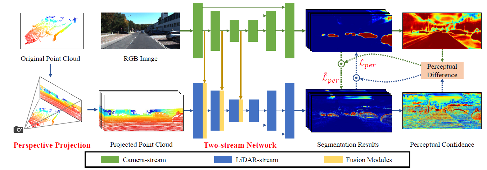
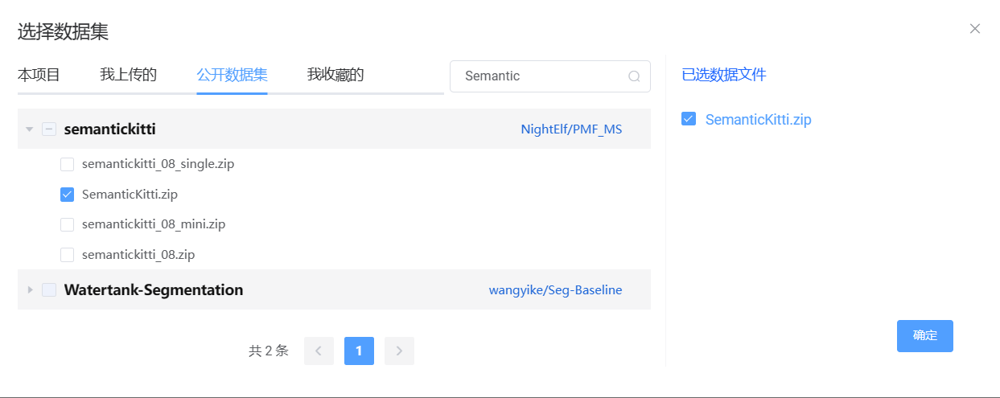
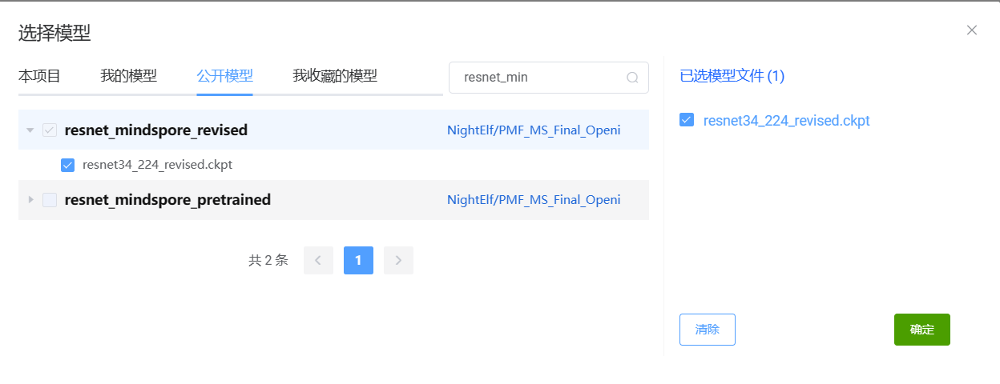

# Perception-Aware Multi-Sensor Fusion for 3D LiDAR Semantic Segmentation（mindspore）

# Contents

- [PMF](#pmf)
  - [Model Architecture](#model-architecture)
  - [Requirements](#requirements)
  - [Install dependencies](#install-dependencies)
- [Dataset](#dataset)
  - [Data Preparation](#data-preparation)
  - [Directory structure of dataset](#directory-structure-of-dataset)
- [Pretrained Model](#pretrained-model)
  - [Model Preparation](#model-preparation)
- [Quick Start](#quick-start)
- [Script Description](#script-description)
  - [Script Parameter](#script-parameter)
- [Training](#training)
  - [Training Process](#training-process)
  - [Training Result](#training-result)
- [Evaluation](#evaluation)
  - [Evaluation Process](#evaluation-process)
- [Performance](#performance)
  - [Training Performance](#training-performance)
  - [Inference Performance](#inference-performance)
- [Weight Link](#weight-link)

# [PMF](#contents)

Mindspore implementation for ***"Perception-Aware Multi-Sensor Fusion for 3D LiDAR Semantic Segmentation"***

Please read the [origin paper](https://arxiv.org/pdf/2106.15277.pdf) or [original pytorch implementation](https://github.com/ICEORY/PMF) for more detailed information.

## [Model Architecture](#contents)



## [Requirements](#contents)

- hardware
  - For Ascend: Ascend 910.
  - For GPU: cuda==11.1
- Framework
  - Mindspore = 1.8.1
- Dataset
  - SemanticKitti
- Third Package
  - Python==3.7
  - pyyaml
  - tensorboardX
  - mindvision

### Install dependencies
`pip install -r requirements.txt`

## [Dataset](#contents)

### Data Preparation
GPU
1. Download SemanticKitti dataset from this [link](http://semantic-kitti.org/dataset.html)
2. the structure of the dataset as follows

### Directory structure of dataset

```text
dataset
└── sequences
    ├── 00
    │    ├── image_2
    │    ├── labels
    │    ├── velodyne
    │    ├── calib.txt
    │    ├── poses.txt
    │    └── times.txt
    ├── 01
    ...
    └── 10
```

Ascend

search SemanticKitti on Openi



## [Pretrained Model](#contents)

### Model Preparation

GPU

forDownload preatrained model from this [link](https://pan.baidu.com/s/1Rn55uHm5uLi5V8GLnwhE3g?pwd=az18) .

Ascend

search specific resnet on Openi



## [Quick Start](#contents)

For GPU:

```shell
# Train_standalone
sh src/script/train_pmf_gpu.sh
# Train_distributed
sh src/script/mpi_train_pmf_gpu.sh
# Eval_standalone
sh src/script/eval_pmf_gpu.sh
# Eval_distributed
sh src/script/mpi_eval_pmf_gpu.sh
```

For Ascend:

```bash
# Train
train.py --config_path /cache/code/pmf/src/config/train_server_kitti.yaml
# Eval
eval.py --config_path /cache/user-job-dir/code/src/config/eval_server_kitti.yaml
```

## [Script Description](#contents)

```text
├── src
│   ├── config
│   │   ├── eval_server_kitti.yaml              # eval configuration
│   │   ├── train_server_kitti.yaml             # train configuration
│   │   ├── eval_option.py                      # eval configuration
│   │   └── option.py                           # train configuration
|   ├── dataset                                 # class and functions for Mindspore dataset
│   │   ├── preprocess
│   │   │   ├── augmentor.py                    # pointcloud argument
│   │   │   └── projection.py                   # projection argument
│   │   ├── semantickitti
│   │   │   ├── parser.py                       # dataset load
│   │   │   ├── semantic-kitti.yaml             # semantickitti configuration
│   │   │   └── semantic-kitti-all.yaml         # semantickitti-all configuration
│   │   ├── perspective_view_loader.py          # dataset class for train
│   │   └── data_argument.py                    # data_argument
│   ├── models                                  # network architecture and loss function
│   │   ├── pmf.py                              # network architecture
│   │   ├── resnet.py                           # backbone network
│   │   ├── salsanext.py                        # network
│   │   ├── resnet.py                           # pretrainedmodel network
│   │   ├── focal_loss.py                       # focalloss function with mask
│   │   └── lovasz_softmax.py                   # lovaszloss function with mask
│   ├── scripts
│   │   ├── eval_pmf_gpu.sh                     # Eval: pmf on GPU
│   │   ├── train_pmf_gpu.sh                    # Train: pmf on GPU
│   │   ├── mpi_train_pmf_gpu.sh                # MpiTrain: pmf on GPU
│   │   └── mpi_eval_pmf_gpu.sh                 # MpiEval: pmf on GPU
│   └── utils
│   │   ├── avgmeter.py                         # avgmeter
│   │   ├── callback.py                         # callback
│   │   ├── common.py                           # net with loss
│   │   ├── local_adapter.py                    # global parameters
│   │   ├── lr_schedule.py                      # dynamic lr
│   │   ├── metric.py                           # net with metric
│   │   ├── recorder.py                         # log
│   │   └── utils.py                            # utils
├── eval.py
├── README.md
├── requirements.txt
├── openi.py
└── train.py
```
### Script Parameter
we use `train_pmf_gpu.sh` as an example:
```bash
python train.py\
  --config_path src/config/train_server_kitti.yaml\
  --device_target GPU
```
The following table describes the arguments. Some default Arguments are defined in `src/config/train_server_kitti.yaml`, `src/config/eval_server_kitti.yaml`. You can change freely as you want.

| Config Arguments  | Explanation                                       |
| ----------------- | ------------------------------------------------- |
| `--config_path`   | Some default Arguments for training or evaluation |
| `--device_target` | chose "Ascend" or "GPU", default: "Ascend"        |

## [Training](#contents)

### Training Process

For GPU on SemanticKitti:

1. Revising the data path, pretrained model path in `/src/config/train_server_kitti.yaml` and `/src/config/eval_server_kitti.yaml`. For example:

```bash
# data_path
data_root: "/home/ubuntu/hdd1/stf2/datasets/semantickitti/sequences"
# preatrained_model_path
pretrained_path: "/home/ubuntu/hdd1/ylc/pretrained_model/resnet/resnet34_224_revised.ckpt"
```

2. Executing the order

```shell
# Train_standalone
sh src/script/train_pmf_gpu.sh
# Train_distributed
sh src/script/mpi_train_pmf_gpu.sh
```

For Ascend on SemanticKitti:

```bash
train.py --config_path /cache/code/pmf/src/config/train_server_kitti.yaml
```

### Training Result

Using `bash src/script/mpi_train_pmf_gpu.sh` as an example:

Training results will be stored in `./save_model` , which is determined by `best_model_dev_{rank_id}.ckpt`. For example:

```text
save_model
├── best_model_dev_0.ckpt
└── best_model_dev_1.ckpt
```

## [Evaluation](#contents)

### Evaluation Process

For GPU on SemanticKitti:

```shell
# Eval_standalone
sh src/script/eval_pmf_gpu.sh
# Eval_distributed
sh src/script/mpi_eval_pmf_gpu.sh
```

Note: Before you start eval, please guarantee `./save_model/best_model_dev_{rank_id}.ckpt` is existed when training on GPU.

For Ascend on SemanticKitti:

```bash
eval.py --config_path /cache/user-job-dir/code/src/config/eval_server_kitti.yaml
```

## [Performance](#contents)

### Training Performance

| Parameters          | Ascend 910                                                | GPU (3090)                   |
| ------------------- | --------------------------------------------------------- | ---------------------------- |
| Model Version       | PMF                                                       | PMF                          |
| Resource            | Ascend 910; CPU 2.60GHz, 24cores; Memory 96G; OS Euler2.8 | Nvidia GeForce RTX 3090      |
| uploaded Date       | 12/4/2023 (month/day/year)                                | 12/4/2023 (month/day/year)   |
| MindSpore Version   | 1.8.1                                                     | 1.7.1                        |
| Dataset             | SemanticKitti                                             | SemanticKitti                |
| Training Parameters | epoch=50, batch_size = 3                                  | epoch=50, batch_size = 6     |
| Optimizer           | Adam+SGD                                                  | Adam+SGD                     |
| Loss Function       | FocalLoss+KLLoss                                          | FocalLoss+KLLoss             |
| outputs             | feature vector + probability                              | feature vector + probability |
| Speed               | 1500 ms/step                                              | 1200 ms/step                 |
| Total time          | About 163h49m21s                                          | About 57h02m08s              |
| Checkpoint          | 416.96 MB (.ckpt file)                                    | 416.96 MB (.ckpt file)       |

### Inference Performance

| Parameters        | Ascend                       | GPU                          |
| ----------------- | ---------------------------- | ---------------------------- |
| Model Version     | PMF                          | PMF                          |
| Resource          | Ascend 910; OS Euler2.8      | Nvidia GeForce RTX 3090      |
| Uploaded Date     | 12/4/2023 (month/day/year)   | 12/4/2023 (month/day/year)   |
| MindSpore Version | 1.8.1                        | 1.7.1                        |
| Dataset           | SemanticKitti                | SemanticKitti                |
| batch_size        | 3                            | 6                            |
| outputs           | feature vector + probability | feature vector + probability |
| Accuracy          | 56.8%                        | 58.0%                        |

## [Weight Link](#contents)

[checkpoint link](https://pan.baidu.com/s/1Rn55uHm5uLi5V8GLnwhE3g?pwd=az18)
